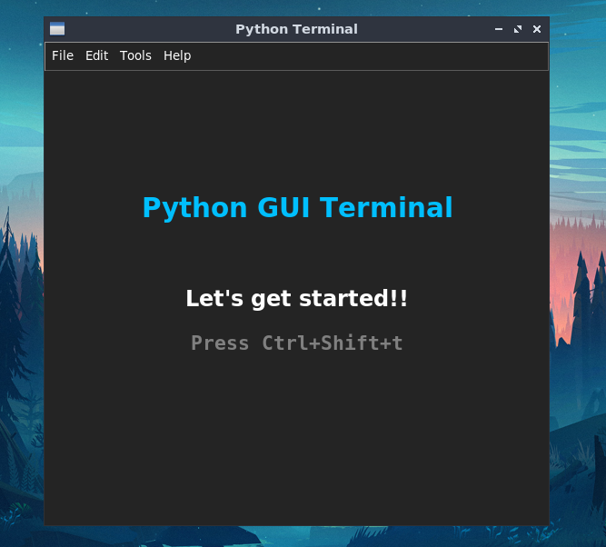

## Python GUI Terminal
[](https://www.python.org/)

Python based **GUI Terminal** developed using standard tkinter package ("Tk interface") with key binding similar Linux terminal. In addition, it includes python interpreter. Terminal uses *Subprocess* and *Os* modules to run system commands.


### Screenshot
------------


### Features
------
- Terminal :fa-terminal: based look and Key bindings.
- Easy customization.
- Support Python Interpreter.

### Limitations
------
* Change of directory in one shell will effect to other shells too. 


## Installion
You can download the zipfile by clicking  [here](https://github.com/Smac01/pyterm/archive/main.zip). 

```
git clone https://github.com/Smac01/pyterm.git
cd pyterm
```

Designed with :blue_heart: and suggestions are heartily welcomed.
